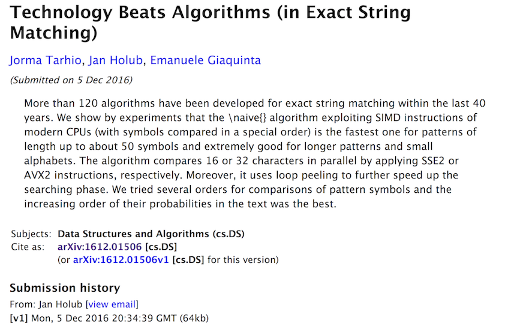

class: center, middle
# How to write a fast grep like command using modern C++

---

# Why?

Our distributed system logs more than one billions log messages a day and we occasionally need to dive into our log files to identify production issues.

---

# Goals

* Create an usable grep command that can be as fast as grep, ripgrep, and/or ag.

* Have reusable and fast text processing libraries that can be used in other projects.

---

# Requirements

* Can find matched lines using user's specified patterns.

* Can display matched line numbers.

* Can work with any file.

---

# Functionality

* A user friendly command line interface.

* An efficient file reading algorithm.

* Fast pattern matching algorithms.

---
# Setup

* All code are compiled with **-O3 -march=native** flags.

* Compiler: gcc-5.5 and clang-900.0.39.2

* Test environments

    * Linux:
      + CPU: Intel(R) Xeon(R) CPU E5-2699 v4 @ 2.20GHz
      + Memory: 773519 MBytes
      + Storage: Very fast network storage.

    * Mac OS:
      + CPU: Intel(R) Core(TM) i7-4770HQ CPU @ 2.20GHz
      + Memory: 16 GB
      + Storage: SSD

---
# Introduction to generic programming

??? Need to get the picture of Alex book.

---
# What is **Policy-based design** 

``` text
Policy-based design, also known as policy-based class design or policy-based programming, is a computer programming paradigm based on an idiom for C++ known as policies. It has been described as a compile-time variant of the strategy pattern, and has connections with C++ template metaprogramming. It was first popularized by Andrei Alexandrescu with his 2001 book Modern C++ Design and his column Generic<Programming> in the C/C++ Users Journal.
```

---
# A sample application based on policy-based design

``` C++

```

---
# How to process command line interface in C++?

``` c++
    namespace po = boost::program_options;
    po::options_description desc("Allowed options");
    std::string begin_time, end_time;
    scribe::MessageFilterParams params;
    std::vector<std::string> args;
    desc.add_options()
        ("help,h", "Print this help")
        ("verbose,v", "Display verbose information.")
        ("info", "Display information messages.")
        ("error", "Display error messages.")
        ("no-regex", "Do not use regex engine for pattern matching.")
        ("begin,b", po::value<std::string>(&begin_time), "Begin time in 'mm-dd-yyyy hh:mm:ss' format.")
        ("end,e", po::value<std::string>(&end_time), "End time in 'mm-dd-yyyy hh:mm:ss' format")
        ("arguments,a", po::value<std::vector<std::string>>(&args), "Search pattern and files")
        ("output,o", po::value<std::string>(&params.outfile), "Output file");
    po::positional_options_description p;
    p.add("arguments", -1);
    po::variables_map vm;
    po::store(po::command_line_parser(argc, argv).options(desc).positional(p).run(), vm);
    po::notify(vm);
```

---

class: center, middle

# How to write an efficient file reading algorithms

---

# [A typical C++ solution](http://insanecoding.blogspot.com/2011/11/how-to-read-in-file-in-c.html "A typical C++ solution")

``` c++
    size_t iostream_linestats(const std::string &afile) {
        std::ifstream t(afile);
        size_t lines = 0;
        std::for_each(std::istreambuf_iterator<char>(t), std::istreambuf_iterator<char>(),
                      [&lines](auto const item) {
                          if (item == EOL) ++lines;
                      });
        return lines;
    }
```

---

# A memory mapped solution

``` c++
    size_t memmap_linestats(const std::string &afile) {
        boost::iostreams::mapped_file mmap(afile, boost::iostreams::mapped_file::readonly);
        auto begin = mmap.const_data();
        auto end = begin + mmap.size();
        size_t lines;
        std::for_each(begin, end, [&lines](auto const item) {
            if (item == EOL) ++lines;
        });
        return lines;
    }
```
---

# A low-level I/O solution

``` c++
    struct LineStats {
        explicit LineStats() : lines(0) {}
        void operator()(const char *buffer, size_t len) {
            for (size_t idx = 0; idx < len; ++idx) {
                if (buffer[idx] == EOL) {
                    ++lines;
                }
            }
        }
        size_t lines;
    };

    // Core algorithm for reading a file
    while (true) {
        auto nbytes = ::read(fd, read_buffer, BUFFER_SIZE);
        if (nbytes < 0) {
            std::stringstream writer;
            writer << "Cannot read file \"" << datafile << "\"";
            throw(std::runtime_error(writer.str()));
        };

        // Apply a given policy to read_buffer.
        policy(read_buffer, nbytes);

        // Stop if we reach the end of file.
        if (nbytes != static_cast<decltype(nbytes)>(BUFFER_SIZE)) { break; };
    }

```
---
# Benchmark results

``` text
Celero
Timer resolution: 0.001000 us
-----------------------------------------------------------------------------------------------------------------------------------------------
     Group      |   Experiment    |   Prob. Space   |     Samples     |   Iterations    |    Baseline     |  us/Iteration   | Iterations/sec  |
-----------------------------------------------------------------------------------------------------------------------------------------------
linestats       | iostream_linest |               0 |               5 |               1 |         1.00000 |     37984.00000 |           26.33 |
linestats       | memmap_linestat |               0 |               5 |               1 |         0.26572 |     10093.00000 |           99.08 |
linestats       | linestats_2_12  |               0 |               5 |               1 |         0.21967 |      8344.00000 |          119.85 |
linestats       | linestats_2_13  |               0 |               5 |               1 |         0.14482 |      5501.00000 |          181.79 |
linestats       | linestats_2_14  |               0 |               5 |               1 |         0.11734 |      4457.00000 |          224.37 |
linestats       | linestats_2_15  |               0 |               5 |               1 |         0.11768 |      4470.00000 |          223.71 |
linestats       | linestats_2_16  |               0 |               5 |               1 |         0.10154 |      3857.00000 |          259.27 |
linestats       | linestats_2_17  |               0 |               5 |               1 |         0.10468 |      3976.00000 |          251.51 |
linestats       | linestats_2_18  |               0 |               5 |               1 |         0.09983 |      3792.00000 |          263.71 |
linestats       | linestats_2_19  |               0 |               5 |               1 |         0.09307 |      3535.00000 |          282.89 |
linestats       | linestats_2_20  |               0 |               5 |               1 |         0.09449 |      3589.00000 |          278.63 |
Complete.

```

---
# Summary

* Our simple benchmark shown that the third solution is the winner and the optimum buffer size is around 64KBytes. We will use this value as a default value for our buffer size in all of our benchmarks.

* The memory mapped solution has a very good performance.

* The first solution is 20x slower than that of the memory mapped solution. **We should not use it in serious applications.**

* The policy based design approach help to create a generic, flexible, and fast file reading algorithm.

---
# The final version of our file reading algorithm

``` c++
    template <size_t BUFFER_SIZE, typename Parser> class FileReader {
      public:
        void operator()(const char *datafile, Parser &parser, const long offset = 0) {
            char read_buffer[BUFFER_SIZE + 1];
            int fd = ::open(datafile, O_RDONLY);
            while (true) {
                auto nbytes = ::read(fd, read_buffer, BUFFER_SIZE);
                if (nbytes < 0) {
                    std::stringstream writer;
                    writer << "Cannot read file \"" << datafile << "\"";
                    throw(std::runtime_error(writer.str()));
                };
                parser(read_buffer, read_buffer + nbytes); // Read buffer is processed using a templatized policy.
                if (nbytes != static_cast<decltype(nbytes)>(BUFFER_SIZE)) { break; };
            }
            ::close(fd);
        }
    };
```

---
# Is our file reading algorithm fast?

To show that our file reading algorithm is fast enough we will create a simple command which is similar to "wc -l" command and benchmark it with a reasonable big scribe log file.

---
# A line counting filter.
``` c++
class LineStats {
public:
  void operator()(const char *begin, const char *end) {
    const char *ptr = begin;
    while (
        (ptr = static_cast<const char *>(memchr(ptr, EOL, end - ptr)))) {
      ++lines;
      const size_t new_eol = file_size + ptr - begin;
      const size_t len = new_eol - current_eol - 1;
      max_len = len > max_len ? len : max_len;
      min_len = len < min_len ? len : min_len;
      current_eol = new_eol;
      ++ptr;
    }
    file_size += end - begin;
  }
  size_t file_size = 0;
  size_t lines = 0;
  size_t max_len = std::numeric_limits<size_t>::min();
  size_t min_len = std::numeric_limits<size_t>::max();
  size_t current_eol = 0;

private:
  static constexpr char EOL = '\n';
};
```
---
# Benchmark results for wc -l

``` text
 Performance counter stats for 'wc -l /mnt/weblogs/scribe/workqueue-execution/workqueue-execution-2018-04-03_00000' (5 runs):

       4300.374643 task-clock                #    0.999 CPUs utilized            ( +-  0.03% )
                11 context-switches          #    0.003 K/sec                    ( +-  7.68% )
                 0 cpu-migrations            #    0.000 K/sec                    ( +- 61.24% )
               170 page-faults               #    0.040 K/sec
     9,469,917,841 cycles                    #    2.202 GHz                      ( +-  0.03% )
   <not supported> stalled-cycles-frontend
   <not supported> stalled-cycles-backend
     3,910,542,147 instructions              #    0.41  insns per cycle          ( +-  0.02% )
       907,972,719 branches                  #  211.138 M/sec                    ( +-  0.02% )
        21,540,040 branch-misses             #    2.37% of all branches          ( +-  0.21% )

       4.305678789 seconds time elapsed                                          ( +-  0.03% )
```
---
# Benchmark results for linestats

``` text
 Performance counter stats for './linestats /mnt/weblogs/scribe/workqueue-execution/workqueue-execution-2018-04-03_00000' (5 runs):

       2690.545592 task-clock                #    0.998 CPUs utilized            ( +-  0.14% )
                22 context-switches          #    0.008 K/sec                    ( +-  7.31% )
                 1 cpu-migrations            #    0.000 K/sec                    ( +- 31.18% )
               361 page-faults               #    0.134 K/sec                    ( +-  0.06% )
     5,924,807,135 cycles                    #    2.202 GHz                      ( +-  0.14% )
   <not supported> stalled-cycles-frontend
   <not supported> stalled-cycles-backend
     2,290,821,363 instructions              #    0.39  insns per cycle          ( +-  0.00% )
       474,603,918 branches                  #  176.397 M/sec                    ( +-  0.00% )
         9,564,301 branch-misses             #    2.02% of all branches          ( +-  0.92% )

       2.695044748 seconds time elapsed                                          ( +-  0.14% )
```

---
# What have we done so far?

* We have created a generic file reading algorithm which might be one of the fastest available solution. See this [link](https://lemire.me/blog/2012/06/26/which-is-fastest-read-fread-ifstream-or-mmap/ "Lemire's blog") for more information. Note that we reuse our algorithm easily for different purposes.

* Our benchmark results have shown that **linestats** command is about 40% faster than **wc -l**. The performance gain comes from below facts

    * Tuning: We choose the best value for our buffer from the file reading benchmark.

    * Inlining: The ability to inline functions at compile in C++ does contribute to the performance gain since our approach and the algorithm used in wc are mostly the same.

---
class: center, middle
# How to write a fast string search algorithm?

---
# First version of [fastgrep](https://github.com/hungptit/fastgrep "A simple implementation of a grep like command")

We have already had a fast file reading algorithm and below are policy classes that are used to create the first working version of fastgrep command:

* MessageFilter: This class is called within the file reading algorithm. It will take a string buffer break it into lines then display lines that match a given string pattern. Note that parsing line by line is not a fastest way to grep the content of a file, however, we will stay with this approach for the rest of this talk.

* utils::Contains: This class check that a pattern is matched with a given text line.

---
# A message filter class

``` c++
    template <typename Constraints> class MessageFilter {
      public:
        ~MessageFilter() {
            if (!buffer.empty()) process();
        }
        void operator()(const char *begin, const char *end) {
            const char *start = begin;
            const char *ptr = begin;
            while ((ptr = static_cast<const char *>(memchr_avx2(ptr, EOL, end - ptr)))) {
                buffer.append(start, ptr - start + 1);
                ++lines;
                process();
                start = ++ptr;
                if (start == end) break;
            }
            if (start != end) { buffer.append(start, end - start); }
        }

      private:
        std::string buffer;
        size_t lines;
        Constraints constraints;
        static constexpr char EOL = '\n';
        void process() {
            if (constraints(buffer)) fmt::print("{}", buffer.data());
            buffer.clear(); // Reset the buffer.
        }
    };
```
---
# An exact pattern matching class

``` c++
    namespace baseline {
        // Search for a sub string.
        class Contains {
          public:
            explicit Contains(const std::string &patt) : pattern(patt) {}
            bool operator()(const std::string &line) {
                if (line.size() < pattern.size()) { return false; }
                return line.find(pattern) != std::string::npos;
            }

          private:
            const std::string pattern;
        };
    } // namespace baseline
```
---
class: center, middle
# Benchmark results

---
# grep
``` text
        Command being timed: "grep Starting1 /mnt/weblogs/scribe/workqueue-execution/workqueue-execution-2018-04-03_00000"
        User time (seconds): 5.27
        System time (seconds): 1.20
        Percent of CPU this job got: 99%
        Elapsed (wall clock) time (h:mm:ss or m:ss): 0:06.48
        Average shared text size (kbytes): 0
        Average unshared data size (kbytes): 0
        Average stack size (kbytes): 0
        Average total size (kbytes): 0
        Maximum resident set size (kbytes): 1924
        Average resident set size (kbytes): 0
        Major (requiring I/O) page faults: 0
        Minor (reclaiming a frame) page faults: 743
        Voluntary context switches: 2
        Involuntary context switches: 13
        Swaps: 0
        File system inputs: 0
        File system outputs: 0
        Socket messages sent: 0
        Socket messages received: 0
        Signals delivered: 0
        Page size (bytes): 4096
        Exit status: 1
```
---
# fastgrep
``` text
        Command being timed: "fastgrep --no-regex -p Starting1 /mnt/weblogs/scribe/workqueue-execution/workqueue-execution-2018-04-03_00000"
        User time (seconds): 42.98
        System time (seconds): 1.41
        Percent of CPU this job got: 99%
        Elapsed (wall clock) time (h:mm:ss or m:ss): 0:44.45
        Average shared text size (kbytes): 0
        Average unshared data size (kbytes): 0
        Average stack size (kbytes): 0
        Average total size (kbytes): 0
        Maximum resident set size (kbytes): 3048
        Average resident set size (kbytes): 0
        Major (requiring I/O) page faults: 0
        Minor (reclaiming a frame) page faults: 929
        Voluntary context switches: 11
        Involuntary context switches: 78
        Swaps: 0
        File system inputs: 0
        File system outputs: 0
        Socket messages sent: 0
        Socket messages received: 0
        Signals delivered: 0
        Page size (bytes): 4096
```

---
# Why our fastgrep command is very slow?

Benchmark results have shown that our fastgrep command is about 7x slower than GNU grep. Our profiling results using perf command show that fastgrep has spent a large portion of time on std::string::find command. It is obvious that we need a better string find algorithm.

``` text
# Overhead         Command        Shared Object
# ........  ..............  ...................  ..............................................................................................
#
    80.09%  message_filter  libstdc++.so.6.0.21  [.] _ZNKSt7__cxx1112basic_stringIcSt11char_traitsIcESaIcEE4findEPKcmm
    10.11%  message_filter  libc-2.23.so         [.] __memcmp_sse4_1
     2.86%  message_filter  message_filter       [.] _ZN6scribe10FileReaderILm65536ENS_13MessageFilterINS_17SimpleConstraintsIN5utils8baseline8
     1.82%  message_filter  [kernel.kallsyms]    [k] copy_user_enhanced_fast_string
     0.94%  message_filter  libc-2.23.so         [.] __memcpy_avx_unaligned
     0.38%  message_filter  libstdc++.so.6.0.21  [.] _ZNSt7__cxx1112basic_stringIcSt11char_traitsIcESaIcEE9_M_appendEPKcm
     0.32%  message_filter  [kernel.kallsyms]    [k] radix_tree_lookup_slot
     0.22%  message_filter  [kernel.kallsyms]    [k] ii_iovec_copy_to_user
     0.19%  message_filter  libstdc++.so.6.0.21  [.] memcmp@plt
     0.16%  message_filter  [kernel.kallsyms]    [k] do_generic_file_read.clone.0
     0.15%  message_filter  ld-2.23.so           [.] _dl_lookup_symbol_x
     0.13%  message_filter  [kernel.kallsyms]    [k] find_get_page
     0.13%  message_filter  [kernel.kallsyms]    [k] put_page
```
---
# How can we improve the performance of std::string::find?



---

# SSE2 version of std::string::find

``` c++
size_t sse2_strstr_anysize(const char *s, size_t n, const char *needle,
                           size_t k) {
  const __m128i first = _mm_set1_epi8(needle[0]);
  const __m128i last = _mm_set1_epi8(needle[k - 1]);
  for (size_t i = 0; i < n; i += 16) {
    const __m128i block_first =
        _mm_loadu_si128(reinterpret_cast<const __m128i *>(s + i));
    const __m128i block_last =
        _mm_loadu_si128(reinterpret_cast<const __m128i *>(s + i + k - 1));
    const __m128i eq_first = _mm_cmpeq_epi8(first, block_first);
    const __m128i eq_last = _mm_cmpeq_epi8(last, block_last);
    uint16_t mask = _mm_movemask_epi8(_mm_and_si128(eq_first, eq_last));
    while (mask != 0) {
      const auto bitpos = bits::get_first_bit_set(mask);
      if (memcmp(s + i + bitpos + 1, needle + 1, k - 2) == 0) {
        return i + bitpos;
      }
      mask = bits::clear_leftmost_set(mask);
    }
  }
  return std::string::npos;
}
```
---
# AVX2 version of std::string::find

``` c++
size_t FORCE_INLINE avx2_strstr_anysize(const char *s, size_t n,
                                        const char *needle, size_t k) {
  const __m256i first = _mm256_set1_epi8(needle[0]);
  const __m256i last = _mm256_set1_epi8(needle[k - 1]);
  for (size_t i = 0; i < n; i += 32) {
    const __m256i block_first =
        _mm256_loadu_si256(reinterpret_cast<const __m256i *>(s + i));
    const __m256i block_last =
        _mm256_loadu_si256(reinterpret_cast<const __m256i *>(s + i + k - 1));
    const __m256i eq_first = _mm256_cmpeq_epi8(first, block_first);
    const __m256i eq_last = _mm256_cmpeq_epi8(last, block_last);
    uint32_t mask = _mm256_movemask_epi8(_mm256_and_si256(eq_first, eq_last));
    while (mask != 0) {
      const auto bitpos = bits::get_first_bit_set(mask);
      if (memcmp(s + i + bitpos + 1, needle + 1, k - 2) == 0) {
        return i + bitpos;
      }
      mask = bits::clear_leftmost_set(mask);
    }
  }
  return std::string::npos;
}
```

---
# Micro-benchmark results

``` text
2018-04-04 01:08:09
Running ./string
Run on (88 X 2199.81 MHz CPU s)
CPU Caches:
  L1 Data 32K (x44)
  L1 Instruction 32K (x44)
  L2 Unified 256K (x44)
  L3 Unified 56320K (x2)
--------------------------------------------------------
Benchmark                 Time           CPU Iterations
--------------------------------------------------------
std_string_find        1153 ns       1152 ns     607371
sse2_string_find        170 ns        170 ns    4098694
avx2_string_find        113 ns        113 ns    6204882
```

---
# AVX2 fastgrep benchmark results

``` text
        Command being timed: "fastgrep --no-regex -p Starting1 /mnt/weblogs/scribe/workqueue-execution/workqueue-execution-2018-04-03_00000"
        User time (seconds): 4.74
        System time (seconds): 1.31
        Percent of CPU this job got: 99%
        Elapsed (wall clock) time (h:mm:ss or m:ss): 0:06.07
        Average shared text size (kbytes): 0
        Average unshared data size (kbytes): 0
        Average stack size (kbytes): 0
        Average total size (kbytes): 0
        Maximum resident set size (kbytes): 3048
        Average resident set size (kbytes): 0
        Major (requiring I/O) page faults: 0
        Minor (reclaiming a frame) page faults: 929
        Voluntary context switches: 9
        Involuntary context switches: 11
        Swaps: 0
        File system inputs: 0
        File system outputs: 0
        Socket messages sent: 0
        Socket messages received: 0
        Signals delivered: 0
        Page size (bytes): 4096
        Exit status: 0
```

---
class: center, middle
# Benchmar results in my Macbook Pro

---
# grep

``` text
015249:commands hdang$ /usr/bin/time -lp grep Starting1 ../data/workqueue-execution_current
real         3.27
user         3.20
sys          0.04
   3162112  maximum resident set size
         0  average shared memory size
         0  average unshared data size
         0  average unshared stack size
       821  page reclaims
         0  page faults
         0  swaps
         0  block input operations
         0  block output operations
         0  messages sent
         0  messages received
         0  signals received
         2  voluntary context switches
      1470  involuntary context switches
```

---
# Brew grep

``` text
015249:commands hdang$ /usr/bin/time -lp ggrep Starting1 ../data/workqueue-execution_current
real         0.12
user         0.08
sys          0.03
   3264512  maximum resident set size
         0  average shared memory size
         0  average unshared data size
         0  average unshared stack size
       813  page reclaims
         0  page faults
         0  swaps
         0  block input operations
         0  block output operations
         0  messages sent
         0  messages received
         0  signals received
         2  voluntary context switches
        44  involuntary context switches
```

---
# ag

``` text
015249:commands hdang$ /usr/bin/time -lp ag Starting1 ../data/workqueue-execution_current
real         0.16
user         0.03
sys          0.12
 190394368  maximum resident set size
         0  average shared memory size
         0  average unshared data size
         0  average unshared stack size
     47975  page reclaims
         0  page faults
         0  swaps
         0  block input operations
         0  block output operations
         0  messages sent
         0  messages received
         0  signals received
         9  voluntary context switches
        39  involuntary context switches
```

---
# ripgrep

``` text
015249:commands hdang$ /usr/bin/time -lp rg Starting1 ../data/workqueue-execution_current
real         0.14
user         0.09
sys          0.05
   4915200  maximum resident set size
         0  average shared memory size
         0  average unshared data size
         0  average unshared stack size
      1216  page reclaims
         0  page faults
         0  swaps
         0  block input operations
         0  block output operations
         0  messages sent
         0  messages received
         0  signals received
         2  voluntary context switches
        47  involuntary context switches
```

---
# fastgrep

``` text
015249:commands hdang$ /usr/bin/time -lp ./fastgrep --no-regex -p Starting1 ../data/workqueue-execution_current
real         0.07
user         0.02
sys          0.03
   3198976  maximum resident set size
         0  average shared memory size
         0  average unshared data size
         0  average unshared stack size
       797  page reclaims
         0  page faults
         0  swaps
         0  block input operations
         0  block output operations
         0  messages sent
         0  messages received
         0  signals received
         2  voluntary context switches
        48  involuntary context switches
```

---
# What have we learned?

* Benchmarking/profiling tools are your friends when debugging/investigating performance issues.

* Optimized string matching algorithms do significantly improve the performance of fastgrep.

---
# Are we done?

* We do need to support regular expression.

* Allow users to filter out log messages using timestamps.

---
# Regular expression

* [Regular Expression Matching Can Be Simple And Fast](https://swtch.com/~rsc/regexp/regexp1.html)

* [Comparison of regex engines.](https://rust-leipzig.github.io/regex/2017/03/28/comparison-of-regex-engines/)

---
# A simple regex matcher using hyperscan

``` c++
class RegexMatcher {
public:
  explicit RegexMatcher(const std::string &patt) {
    pattern = patt;
    hs_compile_error_t *compile_err;
    hs_compile(pattern.c_str(), HS_FLAG_DOTALL, HS_MODE_BLOCK, NULL, &database,
               &compile_err);
    hs_alloc_scratch(database, &scratch);
  }
  bool operator()(const std::string &data) {
    if (data.empty())
      return false;
    char *ptr = const_cast<char *>(pattern.c_str());
    auto errcode = hs_scan(database, data.data(), data.size(), 0, scratch,
                           event_handler, ptr);
    if (errcode == HS_SUCCESS) {
      return false;
    } else if (errcode == HS_SCAN_TERMINATED) {
      return true;
    } else {
      throw std::runtime_error("Unable to scan input buffer");
    }
  }
private:
  hs_database_t *database = NULL;
  hs_scratch_t *scratch = NULL;
  std::string pattern;
};
```

---
class: center, middle
# Benchmark results

---
# fastgrep using regex

``` text
015249:commands hdang$ /usr/bin/time -lp ./fastgrep -p Starting1 ../data/workqueue-execution_current
real         0.07
user         0.03
sys          0.03
   4308992  maximum resident set size
         0  average shared memory size
         0  average unshared data size
         0  average unshared stack size
      1068  page reclaims
         0  page faults
         0  swaps
         0  block input operations
         0  block output operations
         0  messages sent
         0  messages received
         0  signals received
         2  voluntary context switches
        34  involuntary context switches
```

---
class: center, middle
# How to write an efficient timestamp parser

---
# An typical solution using **strptime**

``` c++
// Basic implementation using strptime.
void strftime(benchmark::State &state) {
    struct tm tm;
    for (auto _ : state) {
        strptime(timestamp, "%m-%d-%Y %H:%M:%S", &tm);
    }
}
```

---
# Our customized timestamp parser
``` c++
struct _ts {
    unsigned char tm_isdst;
    unsigned char tm_sec;
    unsigned char tm_min;
    unsigned char tm_hour;
    unsigned char tm_mday;
    unsigned char tm_mon;
    unsigned short tm_year;
};

union _tsdata {
    detail::_ts ts;
    int64_t value;
};

// A timestamp string will be in this format "MM/DD/YYYY hh::mm::ss"
template <typename T> T parse_scribe_timestamp(const char *ptr) {
    T tm;
    tm.data.ts.tm_mon = parse_digits<2>(ptr, 0);
    tm.data.ts.tm_mday = parse_digits<2>(ptr + 3, 0);
    tm.data.ts.tm_year = parse_digits<4>(ptr + 6, 0);
    tm.data.ts.tm_hour = parse_digits<2>(ptr + 11, 0);
    tm.data.ts.tm_min = parse_digits<2>(ptr + 14, 0);
    tm.data.ts.tm_sec = parse_digits<2>(ptr + 17, 0);
    tm.data.ts.tm_isdst = 0; // We do not care about day light saving when parsing log data.
    return tm;
}
```

---
# Benchmark results

``` text
2018-04-15 16:15:32
Running ./timeutils
Run on (8 X 2200 MHz CPU s)
CPU Caches:
  L1 Data 32K (x4)
  L1 Instruction 32K (x4)
  L2 Unified 262K (x4)
  L3 Unified 6291K (x1)
---------------------------------------------------
Benchmark            Time           CPU Iterations
---------------------------------------------------
strftime           114 ns        114 ns    6138251
fast_parser          4 ns          4 ns  121000501
```

---
# Summary

* Our customized timestamp is a big win, it offers 50x speedup on Linux compared with **strptime** function. We can significantly speedup log search tasks if we know our begin and end time of log messages.

* hyperscan is very easy to use and it makes fastgrep regex search as fast as that of grep and ripgrep.


---
class: center, middle
# Demo

---
# Conclusions

* fastgrep's raw performance is as good as the best grep like commands i.e GNU grep and [ripgrep][ripgrep]. However, it can filter our scribe log messages using timestamp.

* Generic programming paradigm is a big win. It helps to create reusable, flexible, and performant algorithms.

* The standard C++ functions for string handling are inefficient i.e std::find and std::ifstream.

* Creating efficient solutions using modern C++ is not a trivial task. From our examples, we can easily see that a regular C++ code might be significantly slower than that of a similar code writtent in other compiled languages such as C, Rust, or may be Go.

---


# Todo list

* Improve the usability of fastgrep command.

* Need a detail benchmark.

---
class: center, middle
# Q/A

---
# Acknowledgement

* SSE2/AVX2 code is the modified version of [sse4-strstr](https://github.com/WojciechMula/sse4-strstr "sse4-strstr")

* References for my fast file reading algorithm are [lemire's blog post](https://lemire.me/blog/2012/06/26/which-is-fastest-read-fread-ifstream-or-mmap/ "Lemire's blog") and [GNU wc command](https://www.gnu.org/software/coreutils/manual/html_node/wc-invocation.html "wc").

* Used Below are libraries and tools:
  * [Catch2](https://github.com/catchorg/Catch2 "Catch2")
  * [hyperscan](https://www.hyperscan.io/ "hyperscan")
  * [utils](https://github.com/hungptit/utils "utils")
  * [ioutils](https://github.com/hungptit/ioutils "A blazing fast file I/O library")
  * [boost](https://www.boost.org/ "Boost libraries")
  * [fmt](https://github.com/fmtlib/fmt "A modern formatting library")
  * [cereal](https://github.com/USCiLab/cereal "A C++11 library for serialization")
  * [CMake](https://cmake.org/ "CMake")
  * [benchmark](https://github.com/google/benchmark)
  * [Celero](https://github.com/DigitalInBlue/Celero)
  * [gcc](https://gcc.gnu.org/)
  * [clang](https://clang.llvm.org/)
  * [perf](https://en.wikipedia.org/wiki/Perf_(Linux))

[ripgrep]: https://github.com/BurntSushi/ripgrep "ripgrep"
